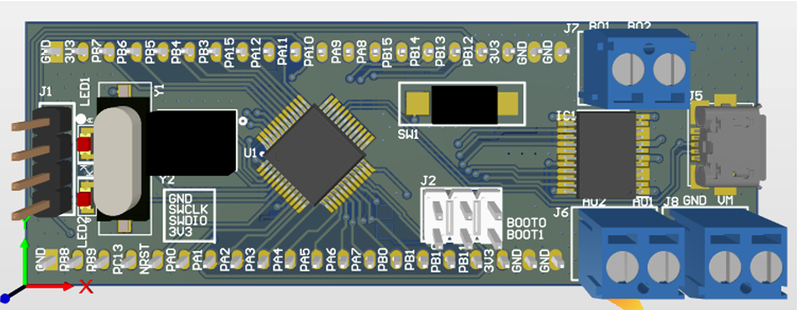
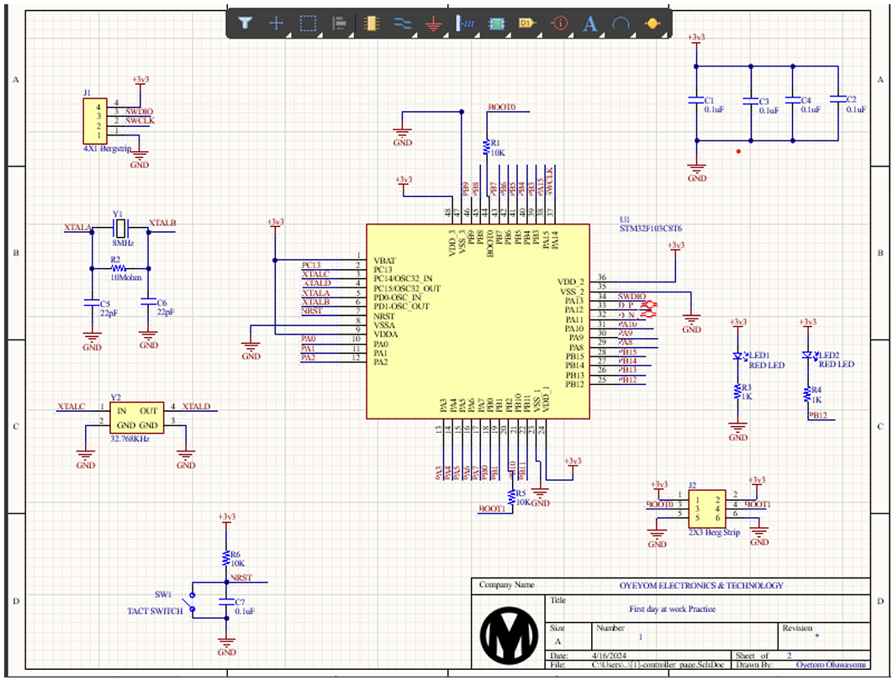
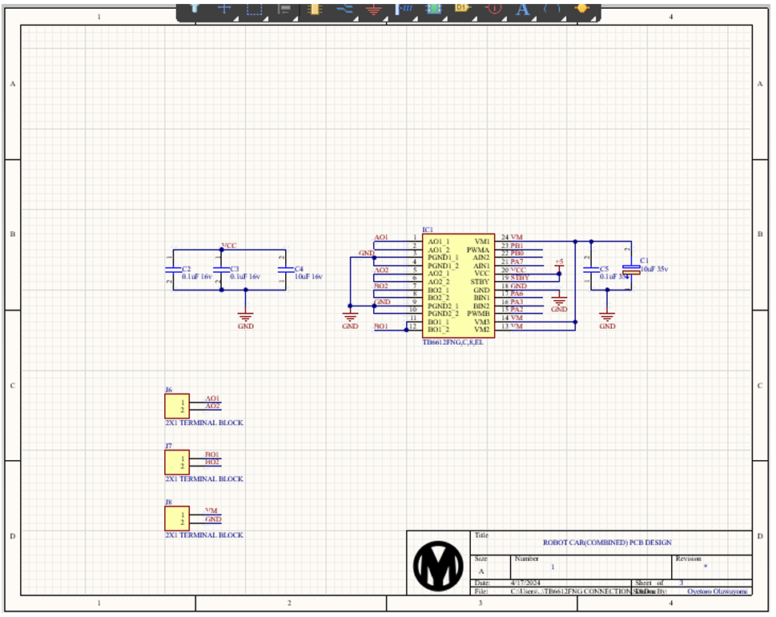
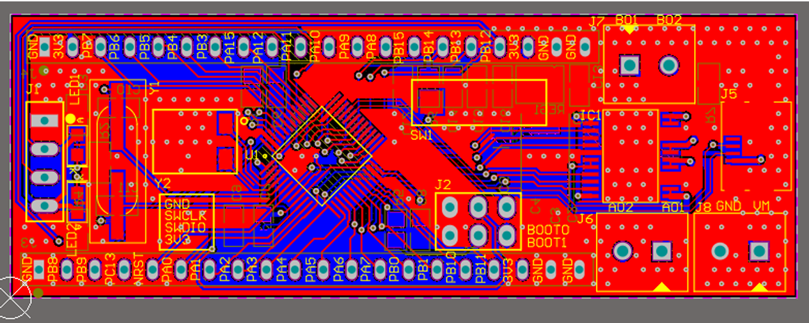
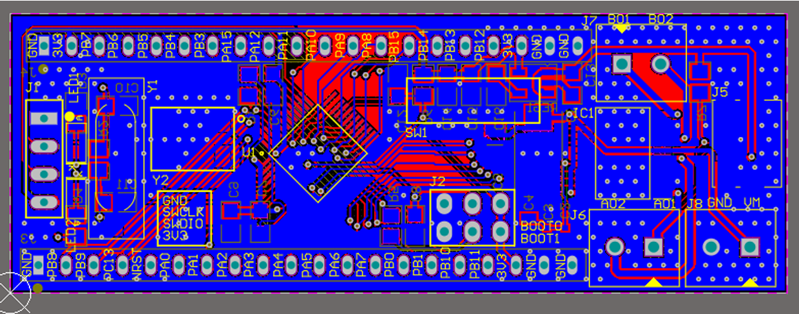
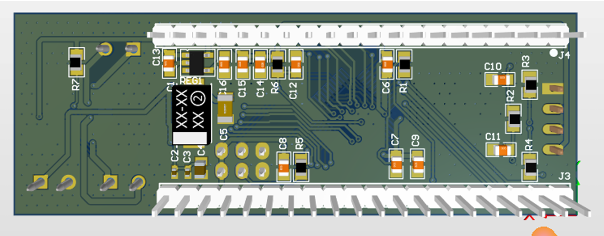

# Robot Car PCB — STM32F103 + TB6612FNG Motor Driver

> A combined single-board PCB integrating the STM32F103C8T6 microcontroller 
> and TB6612FNG dual motor driver, designed specifically to fit a robot car chassis.

## Overview
This project involved designing a single PCB that combines both the microcontroller 
and motor driver circuitry onto one board. The board was dimensioned to match a 
robot car chassis (70.237mm × 25.4mm), eliminating the need for separate boards 
and wiring between them.

The TB6612FNG handles PWM-controlled dual DC motor drive, while the STM32F103 
provides the processing and control logic.

## Key Features
- STM32F103C8T6 microcontroller + TB6612FNG motor driver on a single board
- Board sized to fit robot car chassis: 70.237mm × 25.4mm
- Terminal block connectors for Motor A and Motor B outputs
- Micro USB connector for programming
- 5V → 3.3V onboard regulation
- PWM motor speed and direction control via STM32 GPIO
- SWD debug interface, RESET and BOOT mode support
- 2-layer PCB with ground polygon pour

## Tools Used
- Altium Designer (schematic capture, PCB layout, 3D render, Gerber output)

## Board Specifications
| Parameter | Value |
|---|---|
| Dimensions | 70.237mm × 25.4mm |
| Layers | 2 |
| MCU | STM32F103C8T6 (LQFP-48) |
| Motor Driver | TB6612FNG (SOP-24) |
| Motor Supply | 4.5V – 13.5V |
| Logic Supply | 3.3V (onboard regulated) |
| Motor Outputs | 2× DC motor channels (A & B) |

## Components Used
- STM32F103C8T6 Microcontroller
- TB6612FNG Dual Motor Driver IC
- RT9193-33GB LDO Voltage Regulator
- Capacitors: 0.1µF, 1µF, 22pF
- Resistors: 1kΩ, 10kΩ
- Crystal Oscillators: 8MHz, 32.768KHz
- Micro USB 2.0 Connector
- Terminal Block Connectors (Motor A, Motor B, VM)
- 20x1 Bergstrip Headers (×2), 2x3 SWD Header
- Tact Switch, Red SMD LEDs

## Schematic

## PCB Layout

## 3D Render

## Design Process
1. Designed multi-sheet schematic (MCU sheet + motor driver sheet)
2. Sized PCB board to match physical robot chassis dimensions
3. Placed components with motor connectors at board edges for easy wiring
4. Routed power and signal tracks, applied ground polygon pour
5. Generated Gerber files for fabrication

## What I Learned
- Integrating multiple ICs (MCU + motor driver) on a single board
- Chassis-driven PCB dimensioning constraints
- Motor driver decoupling and power trace routing for higher currents
- Multi-sheet schematic design and cross-sheet signal management
